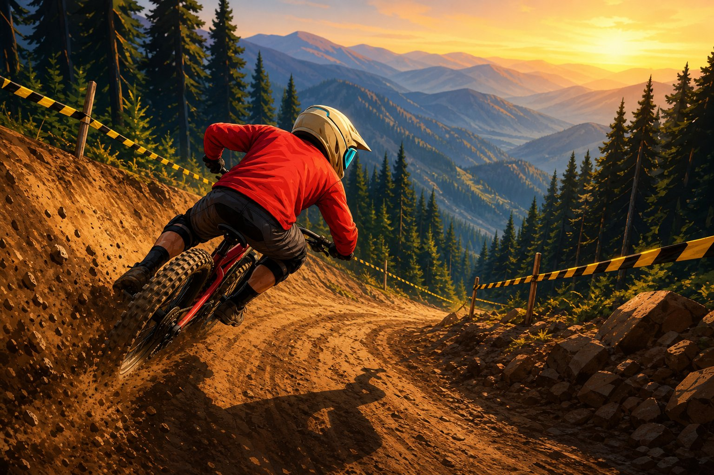
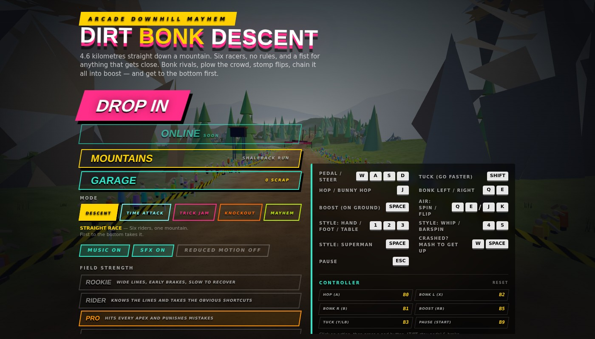
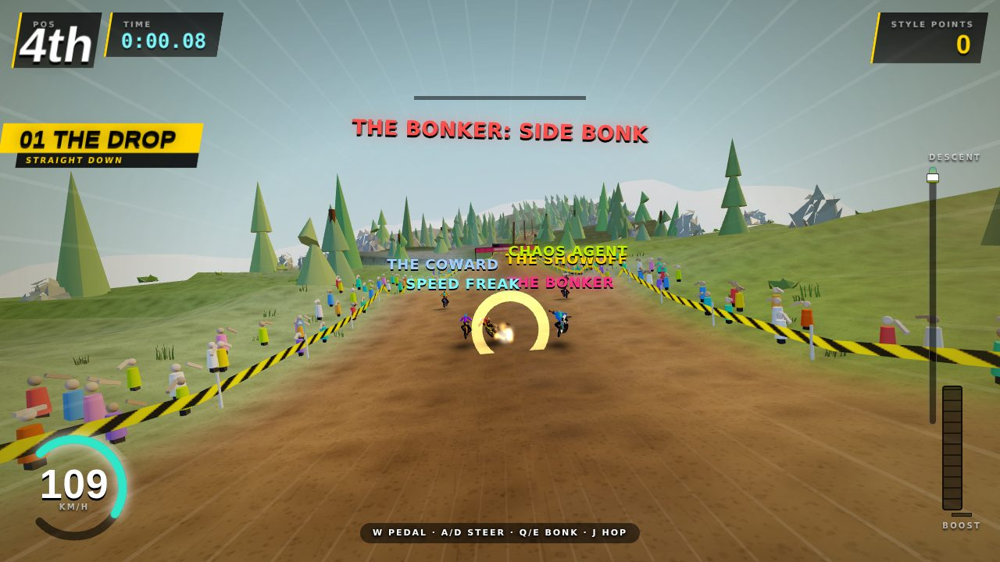
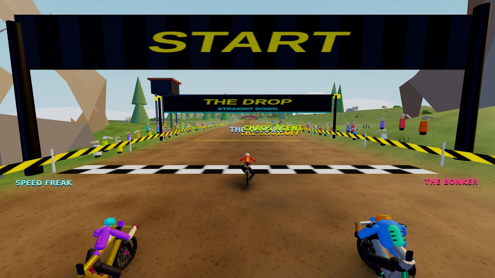
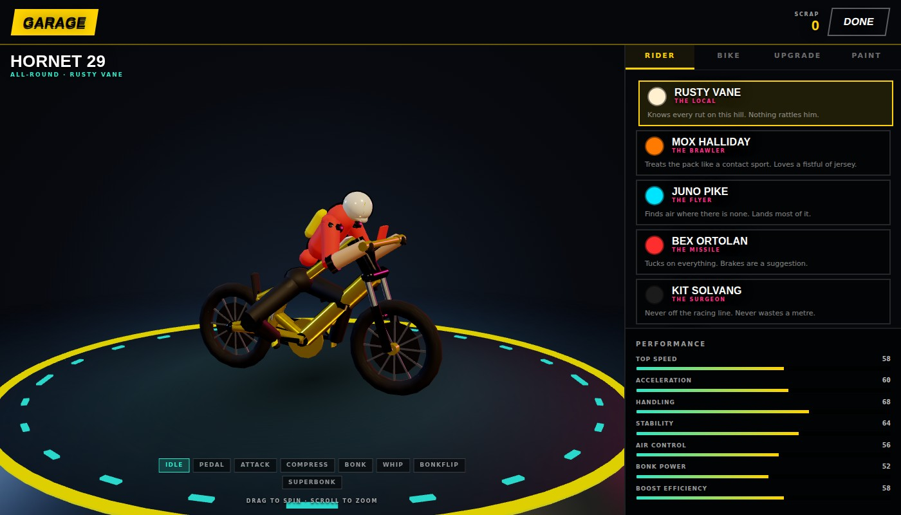
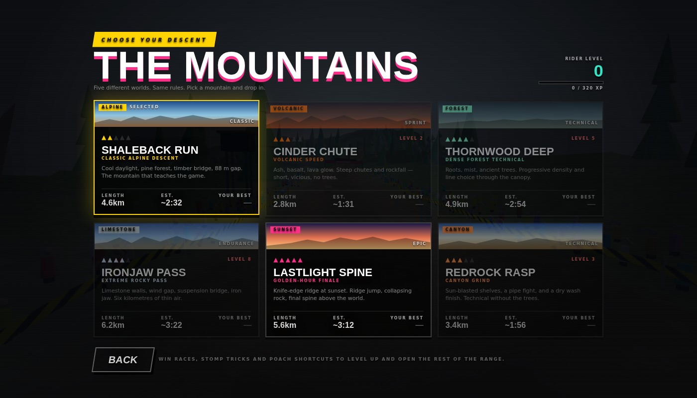

<div align="center">

# DIRT BONK DESCENT

**Arcade downhill mayhem in the browser.**

Six riders. One mountain. No rules, and a fist for anything that gets close.



Built with **Three.js**, **React** and **TypeScript** — every asset is generated at runtime.
No models, no textures, no audio files.

</div>

---

## Screenshots

<p align="center">
  
  
</p>
<p align="center">
  
  
</p>
<p align="center">
  
</p>

| Shot | What's on screen |
|---|---|
| **Menu** | All five modes live · difficulty · pad binds |
| **Race** | Chase cam · pack · SIDE BONK callouts · speedo |
| **Drop** | Shoulder-to-shoulder start pack (holeshot fight) |
| **Garage** | Product turntable · class silhouettes · upgrades |
| **Mountains** | Shaleback · Cinder · Thornwood · Ironjaw · Lastlight |

---

## What it is

A 4.6 km arcade downhill racer inspired by the wild, fast, chaotic feel of early-2000s
downhill games. You drop into a hand-built mountain against five AI riders with distinct
personalities, and get to the bottom by any means available: carving berms, poaching
hidden shortcuts, stomping tricks, and shoulder-checking rivals into the trees.

Everything in the game — terrain, riders, bikes, trees, rocks, textures, music and
sound effects — is **generated procedurally at load time**. The entire build is a single
self-contained HTML file.

## Play

```bash
npm install
npm run dev
```

Then open the local URL. `npm run build` produces a single-file `dist/index.html`.

### Controls

| Action | Keys |
|---|---|
| Steer | `A` `D` / `←` `→` |
| Pedal / Brake | `W` / `S` |
| Tuck (less drag) | `Shift` |
| Hop | `J` |
| Bonk left / right | `Q` / `E` |
| Boost | `Space` |
| Air: spin | `Q` / `E` |
| Air: flip | `J` / `K` |
| Style tricks | `1` `2` `3` `4` `5` `Space` |
| Crashed? Mash to recover | `W` / `Space` |
| Pause | `Esc` |

A connected gamepad is picked up automatically — no setup, no remap UI yet. Keyboard
stays authoritative; controller intent is OR'd in on top of it.

| Action | Controller |
|---|---|
| Steer | Left stick / D-pad |
| Pedal / Brake | `RT` / `LT` |
| Tuck | `Y` / `LB` |
| Hop | `A` |
| Bonk left / right | `X` / `B` |
| Boost | `RB` |
| Pause | `Start` |

Touch devices get an on-screen layout: a slide-anywhere steering strip, automatic
throttle, and contextual action buttons that switch from **BONK** to **WHIP** in the air.

---

## Core loop

```
SELECT RIDER → SELECT BIKE → SELECT MOUNTAIN → DROP IN
    → RACE → SHORTCUTS → TRICKS → BOOST → BONK
    → FINISH → EARN XP / SCRAP → UPGRADE → UNLOCK → DESCEND AGAIN
```

A run takes roughly **1:35 – 3:30** depending on the mountain.

---

## Systems

### Start line
Mode-aware gate: **Descent / Trick Jam / Mayhem** pack shoulder-to-shoulder for a
chaos holeshot; **Knockout** keeps a staggered depth grid so cuts stay readable;
**Time Attack** gives the player the solo gate with the field sat back as soft ghosts.
Gate drop fires dirt under every tyre plus a whoosh / cheer kick (`launchPack`).

### Bikes
Four readable silhouettes — **Hornet** (reference), **Slab** (truss + armour + dual crown),
**Wisp** (knife tubes, bare hardware), **Bolt** (long/low, dual crown). Frame tubes,
bars, and stays all scale with class so garage and chase cam agree.

### Physics
Two-wheel contact model: the bike samples ground height at both axles (1.22 m wheelbase),
so it pitches over rocks, gets bucked by lips, and unweights the front over crests.
Sprung chassis pitch, telescoping fork, pivoting swingarm with a working coil shock, and
**terrain pumping** — load into a compression, release over the crest for free speed.

### Bike state machine
Twelve explicit states (`GROUNDED`, `DRIFTING`, `AIRBORNE`, `TRICKING`, `LANDING`,
`BOOSTING`, `CRASHING`, …) resolved by a **pure function** from an input snapshot.
Per-state physics lives in a data table, not in branches. Determinism, totality and state
reachability are verified by an exhaustive sweep — see [Debug tools](#debug-tools).

### The bonk system
Every rider-on-rider collision resolves through one impulse model using relative velocity,
collision angle, mass, momentum, surface grip and both riders' states. Six outcomes:

`SIDE` · `FRONT` · `REAR` · `WALL` · `DOUBLE` · `MEGA`

Geometry decides the base type; modifiers upgrade it. All six are provably reachable.

### Tricks
Three independent channels that combine freely:

- **Rotations** — 180 → 1080
- **Flips** — backflip / frontflip, singles to quads
- **Style** — no-hander, one-footer, tabletop, tailwhip, barspin, superman

Because the channels are independent, *"DOUBLE BACKFLIP 720 TABLETOP"* isn't a special
case — it's what the name composer produces when you hold all three. Combining channels
multiplies the score; holding a big pose costs rotation control.

### AI
Five personalities — **SPEED FREAK**, **BONKER**, **SHOWOFF**, **COWARD**, **CHAOS AGENT** —
each defined by ten behavioural weights, crossed with four difficulty tiers.

Four tiers — **ROOKIE**, **RIDER**, **PRO**, **ABSURD**.
Difficulty scales decision quality first (line, combat, reaction 0.42 s → 0.06 s), with
speed ceilings close enough that a tucked player still has to race: ROOKIE ~39 m/s →
ABSURD ~45 m/s against a player soft-cap of 47. Pure speed is no longer a free win.

Mountains also reshape the field via **theme feel** (volcanic send-it, forest caution,
sunset tricks) without rewriting personalities — see [`docs/TRACKS.md`](docs/TRACKS.md).

### Crashes
Six causes, each with its own ragdoll profile so you can identify what went wrong from the
silhouette alone. Going over the bars pitches you forward; a side bonk barrel-rolls you;
riding off a cliff is a long quiet drop. Bikes eject and cartwheel independently.
Mashing cuts recovery to well under a second.

### Progression
XP comes from eight itemised sources and is **separate from currency**:

- **XP → rider level → unlocks upgrade tiers** (earned by playing)
- **Scrap → cosmetics only** (trails, effects, emotes, skins)

You cannot buy past a level gate. The rule is enforced by a compile-time type assertion,
not by convention.

---

## Modes

| Mode | Status | Win by |
|---|---|---|
| **DESCENT** | live | position |
| **TIME ATTACK** | live | beat the clock |
| **TRICK JAM** | live | style score (×2 trick mult) |
| **KNOCKOUT** | live | last standing (20 s cuts) |
| **MAYHEM** | live | position · hazards ×2.4 · aggression ×2 |

`hazardScale` densifies props/scenery when a mode builds the course. Knockout
cuts the last rider every 20 seconds until one remains.

## The mountains

Five full TrackDefinitions — each with its own spline sections, landmarks, sky,
lighting, ridge palette and ambient particles. See [`docs/TRACKS.md`](docs/TRACKS.md).

| Mountain | Theme | Feel |
|---|---|---|
| **SHALEBACK RUN** | alpine | Reference track — pine, timber bridge, 88 m gap |
| **CINDER CHUTE** | volcanic | Ash, basalt, lava glow, steep chutes |
| **THORNWOOD DEEP** | forest | Mist, roots, progressive density |
| **IRONJAW PASS** | limestone | Cliffs, iron jaw, 6.2 km endurance |
| **LASTLIGHT SPINE** | sunset | Golden-hour knife-edge finale |

**SHALEBACK** (reference) — ten hand-authored sections:

| # | Section | Identity |
|---|---|---|
| 01 | THE DROP | Steep summit, snow-capped crags |
| 02 | PINE PANIC | Dense forest, no sightlines |
| 03 | ROCK & ROLL | Technical, rolling boulders |
| 04 | BONK BRIDGE | 7 m timber deck, no tape, nothing underneath |
| 05 | BIG AIR | 88 m gap with a revetment ramp |
| 06 | MUD PIT | Low grip, standing water |
| 07 | SECRET SEND | Hidden shortcut worth 46 m |
| 08 | CLIFFSIDE | The mountain simply stops on the right |
| 09 | BONK CANYON | Wide combat arena |
| 10 | FINAL SEND | Steepest, fastest, into the crowd |

Pacing: release → tension → tension → **combat** → release → tension → reward → dread → **combat** → release.

---

## Technical notes

### Rendering
Three distance bands with per-type LOD reaches, chosen by silhouette value: pine canopies
persist to 700 m because they hold the horizon; ground clutter cuts at 85 m. Instance
buffers are **repacked per band** so the GPU only ever sees in-range instances.

Everything shares one lighting model (`MeshStandardMaterial`) with a deliberate roughness
hierarchy — the world is authored matte (0.88+) so the rider and bike stay the most
optically active things on screen.

### Performance
An adaptive governor measures median frame time and sheds cost in a fixed priority order:

```
particles → scenery LOD → crowd window → pixel ratio
```

Physics is **never** altered by the governor. AI think rate is distance-throttled
(every frame under 60 m, 3 Hz beyond 400 m) with plans cached so movement stays smooth.

### Audio
Fully synthesised in WebAudio. Tyre roll, wind, brakes, chain (clicks fired on real crank
rotation), suspension creak, forest, water, birdsong, crowd — plus an adaptive punk-surf
soundtrack that gains finale layers over the last 500 m. Impacts sidechain-duck the music.

---

## Debug tools

| URL | What it does |
|---|---|
| `?tune` | Headless balance harness. Simulates ~72 races across difficulties and reports win rates, plus verification sweeps for the state machine (~24,500 cases) and bonk system (~8,000 collisions). |
| `?states` | Live overlay: current bike state, transition log, FPS, quality tier, particle count, draw calls, triangles. |
| `?track` / F11 | Track debug: spline, width, section bounds, shortcuts, jumps, landmarks. |
| `?phys` / F8 | Physics gizmos (axles, contact, COM). |

---

## Project structure

```
src/game/
  game.ts          engine, race flow, rider sim
  physics.ts       shared speed / axle / drag constants
  track.ts         procedural course generation + scenery
  mountainsBuild.ts  mountain id → TrackDefinition factory
  trackDef.ts      TrackDefinition + atmosphere presets
  atmosphere.ts    theme sky, ridges, ambient particles
  shaleback.ts     reference mountain (+ cinder / thornwood / …)
  ironjawPass.ts   endurance limestone course
  bikeState.ts     physics state machine (pure resolver + rule table)
  bonk.ts          collision resolver
  tricks.ts        rotation / flip / style composition
  crash.ts         cause-specific ragdoll profiles
  ai.ts            personalities × difficulty tiers
  garage.ts        riders, bikes, upgrades, cosmetics
  progression.ts   XP sources, challenges, unlocks
  modes.ts         race mode rulesets (Descent / Time Attack / Trick Jam)
  audio.ts         procedural audio engine
  models.ts        rider rig + geometry builders
  riderMaterials.ts  material library + progressive dirt
  fx.ts            procedural textures + particle pools
  perf.ts          LOD bands + adaptive governor
src/ui/            HUD, menus, garage, mountain select
```

## Accessibility

- **Reduced motion** — honours `prefers-reduced-motion`, scales shake (22%), camera roll
  (40%), FOV surge (35%) and disables speed lines.
- **Forest readability** — ambient light lifts automatically in dense sections so the
  rider never disappears against the treeline.
- **Hazard telegraphing** — solid obstacles warn with a directional arrow before impact.

## Licence

MIT.
